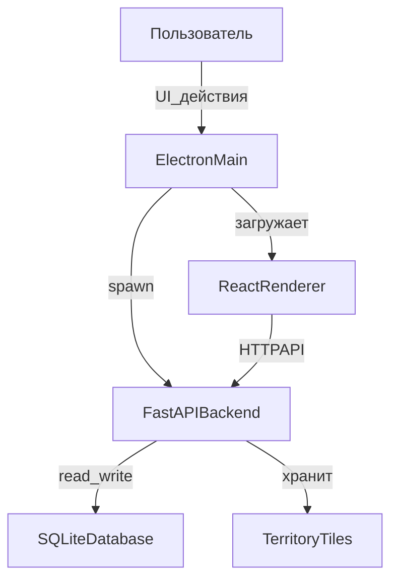

# System Design: Blades Faction Map

## 1. Обзор архитектуры

### 1.1 Компоненты системы



**Компоненты:**
- **Electron Main**: управление жизненным циклом приложения, запуск backend-процесса
- **React Renderer**: UI/визуализация, Canvas-рисование территорий
- **FastAPI Backend**: REST API, бизнес-логика, хранилище данных
- **SQLite Database**: персистентное хранилище проекта

### 1.2 Границы ответственности

| Компонент | Ответственность | НЕ отвечает за |
|-----------|----------------|----------------|
| **Electron Main** | Запуск backend, управление окном, выбор порта, graceful shutdown | Бизнес-логику, данные |
| **Renderer** | UI, Canvas рисование, отправка изменённых тайлов, отображение данных | Хранение данных, валидация бизнес-правил |
| **Backend** | API, CRUD, связи, таймлайн, фильтрация GM/Player, экспорт/импорт | Рисование UI, рендеринг Canvas |
| **SQLite** | Персистентность, транзакции, версионирование снимков | Бизнес-логика |

## 2. Контракты взаимодействия

### 2.1 Electron Main ⇄ Backend

#### 2.1.1 Запуск backend

**Процесс:**
1. Electron Main выбирает свободный порт (например 8000-8999)
2. Запускает backend процесс: `python -m uvicorn app.main:app --host 127.0.0.1 --port {PORT}`
3. Ждёт healthcheck на `http://127.0.0.1:{PORT}/health` (retry 10 раз с интервалом 500ms)
4. При успехе передаёт URL в renderer через `preload`

**Graceful shutdown:**
- Electron отправляет SIGTERM backend-процессу
- Ждёт до 5 секунд на завершение
- При таймауте отправляет SIGKILL

#### 2.1.2 Безопасность (MVP: упрощённая)
- Backend слушает только `127.0.0.1`
- В будущем: токен-аутентификация между Electron и backend

### 2.2 Renderer ⇄ Backend (REST API)

#### 2.2.1 Базовые принципы
- Протокол: HTTP/JSON
- Base URL: `http://127.0.0.1:{PORT}/api`
- Заголовки:
  - `Content-Type: application/json`
  - `X-View-Mode: gm | player` (режим фильтрации)
  - `X-Snapshot-Id: {id}` (опционально, для привязки к снимку)

#### 2.2.2 Стандартные коды ответов
- `200 OK`: успешная операция
- `201 Created`: создание ресурса
- `400 Bad Request`: ошибка валидации
- `404 Not Found`: ресурс не найден
- `409 Conflict`: конфликт данных (например дубликат)
- `500 Internal Server Error`: ошибка сервера

#### 2.2.3 Формат ошибок
```json
{
  "error": {
    "code": "VALIDATION_ERROR",
    "message": "Invalid faction color format",
    "details": {
      "field": "color",
      "value": "invalid"
    }
  }
}
```

### 2.3 API Endpoints (детальные схемы)

#### 2.3.1 Factions API

**GET /api/factions**
- Query params: `?view_mode=gm|player`
- Response: `200 OK`
```typescript
{
  factions: Array<{
    id: string;
    name: string;
    color: string; // hex #RRGGBB
    opacity: number; // 0.0 - 1.0
    notes_public: string; // markdown
    notes_gm?: string; // markdown, только в GM mode
    created_at: string; // ISO8601
    updated_at: string;
  }>
}
```

**POST /api/factions**
- Body:
```typescript
{
  name: string;
  color: string;
  opacity?: number; // default 0.4
  notes_public?: string;
  notes_gm?: string;
}
```
- Response: `201 Created` + созданный объект

**PUT /api/factions/{id}**
- Body: частичное обновление (partial update)
- Response: `200 OK` + обновлённый объект

**DELETE /api/factions/{id}**
- Response: `204 No Content`

#### 2.3.2 People API

**GET /api/people**
- Response:
```typescript
{
  people: Array<{
    id: string;
    name: string;
    aliases: string[];
    status: "alive" | "dead" | "unknown";
    faction_memberships: Array<{
      faction_id: string;
      role?: string;
    }>;
    workplace_place_id?: string;
    home_place_id?: string;
    tags: string[];
    notes_public: string;
    notes_gm?: string; // GM only
  }>
}
```

**POST /api/people**, **PUT /api/people/{id}**, **DELETE /api/people/{id}** — аналогично factions

#### 2.3.3 Places API

**GET /api/places**
```typescript
{
  places: Array<{
    id: string;
    name: string;
    type: "building" | "district" | "landmark" | "other";
    position?: { x: number; y: number }; // координаты на карте
    owner_faction_id?: string;
    notes_public: string;
    notes_gm?: string;
  }>
}
```

#### 2.3.4 Note Pages API

**GET /api/pages**
```typescript
{
  pages: Array<{
    id: string;
    title: string;
    body_markdown: string;
    visibility: "public" | "gm";
    entity_ref?: {
      type: "faction" | "person" | "place";
      id: string;
    };
    created_at: string;
    updated_at: string;
  }>
}
```

#### 2.3.5 Graph API

**GET /api/graph**
- Query params: `?view_mode=gm|player&entity_id={id}&entity_type={type}`
- Response:
```typescript
{
  nodes: Array<{
    id: string;
    type: "faction" | "person" | "place" | "page";
    title: string;
    visibility: "public" | "gm";
  }>;
  edges: Array<{
    from_id: string;
    to_id: string;
    link_type: "wikilink" | "manual" | "reference";
    visibility: "public" | "gm";
  }>;
}
```

**GET /api/graph/backlinks/{page_id}**
- Response: список страниц, ссылающихся на данную

#### 2.3.6 Snapshots API

**GET /api/snapshots**
```typescript
{
  snapshots: Array<{
    id: string;
    at_date: string; // ISO8601
    label: string;
    created_at: string;
  }>;
  active_snapshot_id: string;
}
```

**POST /api/snapshots**
```typescript
{
  at_date: string;
  label: string;
  clone_from?: string; // snapshot_id для дублирования
}
```

**PUT /api/snapshots/active/{id}**
- Переключить активный снимок
- Response: `200 OK`

#### 2.3.7 Territory Tiles API

**GET /api/snapshots/{snapshot_id}/territory/tiles**
- Query params: `?faction_id={id}&z={zoom}&x={x}&y={y}`
- Response: `200 OK` + PNG/WebP blob (binary)
- Headers: `Content-Type: image/png`

**PUT /api/snapshots/{snapshot_id}/territory/tiles/batch**
- Body:
```typescript
{
  faction_id: string;
  tiles: Array<{
    z: number;
    x: number;
    y: number;
    data: string; // base64-encoded PNG
  }>;
}
```
- Response: `200 OK`

**DELETE /api/snapshots/{snapshot_id}/territory/tiles**
- Query params: `?faction_id={id}`
- Response: `200 OK` + deleted count

#### 2.3.8 Map Assets API

**POST /api/snapshots/{snapshot_id}/map**
- Body: multipart/form-data with image file
- Request example:
```
Content-Type: multipart/form-data
file=(binary image data)
```
- Response: `201 Created`
```typescript
{
  status: "ok";
  message: "Map uploaded successfully";
  map_asset_id: string;
  snapshot_id: string;
}
```
- Notes: Replaces existing map if already present (1 map per snapshot)

**GET /api/snapshots/{snapshot_id}/map**
- Response: `200 OK` + binary image data
- Headers: `Content-Type: image/png`
- Response: PNG/JPEG image file

**DELETE /api/snapshots/{snapshot_id}/map**
- Response: `204 No Content`

#### 2.3.9 Export/Import API

**GET /api/export**
- Response: `200 OK` + SQLite file (binary)
- Headers: `Content-Type: application/x-sqlite3`

**POST /api/import**
- Body: multipart/form-data с SQLite файлом
- Response: `201 Created`

### 2.4 Renderer ⇄ Electron Preload (IPC)

**Безопасность:** Используется contextBridge для ограничения доступа

```typescript
// preload.ts expose
window.electronAPI = {
  getBackendURL: () => Promise<string>,
  openFile: (filters) => Promise<string | null>,
  saveFile: (defaultPath) => Promise<string | null>,
}
```

## 3. Модель данных (SQLite Schema)

### 3.1 Основные таблицы

```sql
-- Мир/Город (сеттинг проекта)
CREATE TABLE worlds (
    id TEXT PRIMARY KEY,
    name TEXT NOT NULL,
    description TEXT,
    timezone TEXT NOT NULL DEFAULT 'UTC',
    created_at TEXT NOT NULL,
    updated_at TEXT NOT NULL
);

-- Фракции
CREATE TABLE factions (
    id TEXT PRIMARY KEY,
    world_id TEXT NOT NULL,
    name TEXT NOT NULL,
    color TEXT NOT NULL, -- hex #RRGGBB
    opacity REAL NOT NULL DEFAULT 0.4,
    notes_public TEXT,
    notes_gm TEXT,
    created_at TEXT NOT NULL,
    updated_at TEXT NOT NULL,
    FOREIGN KEY (world_id) REFERENCES worlds(id) ON DELETE CASCADE
);

-- Персонажи (NPC и PC)
CREATE TABLE people (
    id TEXT PRIMARY KEY,
    world_id TEXT NOT NULL,
    name TEXT NOT NULL,
    aliases TEXT, -- JSON array
    status TEXT DEFAULT 'alive', -- alive|dead|unknown
    workplace_place_id TEXT,
    home_place_id TEXT,
    tags TEXT, -- JSON array
    notes_public TEXT,
    notes_gm TEXT,
    created_at TEXT NOT NULL,
    updated_at TEXT NOT NULL,
    FOREIGN KEY (world_id) REFERENCES worlds(id) ON DELETE CASCADE,
    FOREIGN KEY (workplace_place_id) REFERENCES places(id) ON DELETE SET NULL,
    FOREIGN KEY (home_place_id) REFERENCES places(id) ON DELETE SET NULL
);

-- Персонажи игроков (расширение Person)
CREATE TABLE player_characters (
    person_id TEXT PRIMARY KEY,
    playbook TEXT, -- Cutter, Lurk, Slide, etc.
    crew TEXT, -- название команды
    is_active INTEGER NOT NULL DEFAULT 1, -- SQLite boolean
    FOREIGN KEY (person_id) REFERENCES people(id) ON DELETE CASCADE
);

-- Принадлежность к фракциям (many-to-many)
CREATE TABLE faction_memberships (
    id TEXT PRIMARY KEY,
    person_id TEXT NOT NULL,
    faction_id TEXT NOT NULL,
    role TEXT,
    FOREIGN KEY (person_id) REFERENCES people(id) ON DELETE CASCADE,
    FOREIGN KEY (faction_id) REFERENCES factions(id) ON DELETE CASCADE,
    UNIQUE (person_id, faction_id)
);

-- Места
CREATE TABLE places (
    id TEXT PRIMARY KEY,
    world_id TEXT NOT NULL,
    name TEXT NOT NULL,
    type TEXT NOT NULL, -- building|district|landmark|other
    position TEXT, -- JSON {x, y} или NULL
    owner_faction_id TEXT,
    parent_place_id TEXT, -- для иерархии (район -> здание)
    scope TEXT NOT NULL DEFAULT 'public', -- public|gm|player
    notes_public TEXT,
    notes_gm TEXT,
    created_at TEXT NOT NULL,
    updated_at TEXT NOT NULL,
    FOREIGN KEY (world_id) REFERENCES worlds(id) ON DELETE CASCADE,
    FOREIGN KEY (owner_faction_id) REFERENCES factions(id) ON DELETE SET NULL,
    FOREIGN KEY (parent_place_id) REFERENCES places(id) ON DELETE SET NULL
);

-- Страницы заметок
CREATE TABLE note_pages (
    id TEXT PRIMARY KEY,
    world_id TEXT NOT NULL,
    title TEXT NOT NULL,
    body_markdown TEXT NOT NULL,
    scope TEXT NOT NULL DEFAULT 'public', -- public|gm|player
    entity_type TEXT, -- faction|person|place
    entity_id TEXT,
    created_at TEXT NOT NULL,
    updated_at TEXT NOT NULL,
    FOREIGN KEY (world_id) REFERENCES worlds(id) ON DELETE CASCADE,
    UNIQUE (world_id, title)
);

-- Связи (материализованные или вычисляемые из wikilinks)
CREATE TABLE links (
    id TEXT PRIMARY KEY,
    world_id TEXT NOT NULL,
    from_page_id TEXT NOT NULL,
    to_page_id TEXT NOT NULL,
    link_type TEXT NOT NULL, -- wikilink|manual|reference
    scope TEXT NOT NULL DEFAULT 'public', -- public|gm|player
    meta TEXT, -- JSON для дополнительных данных
    FOREIGN KEY (world_id) REFERENCES worlds(id) ON DELETE CASCADE,
    FOREIGN KEY (from_page_id) REFERENCES note_pages(id) ON DELETE CASCADE,
    FOREIGN KEY (to_page_id) REFERENCES note_pages(id) ON DELETE CASCADE,
    UNIQUE (from_page_id, to_page_id, link_type)
);

-- Снимки (таймлайн)
CREATE TABLE snapshots (
    id TEXT PRIMARY KEY,
    world_id TEXT NOT NULL,
    at_date TEXT NOT NULL, -- ISO8601
    label TEXT NOT NULL,
    created_at TEXT NOT NULL,
    FOREIGN KEY (world_id) REFERENCES worlds(id) ON DELETE CASCADE
);

-- Карты (базовые изображения)
CREATE TABLE map_assets (
    id TEXT PRIMARY KEY,
    snapshot_id TEXT NOT NULL,
    image_blob BLOB NOT NULL,
    width INTEGER NOT NULL,
    height INTEGER NOT NULL,
    FOREIGN KEY (snapshot_id) REFERENCES snapshots(id) ON DELETE CASCADE
);

-- Тайлы территорий (маски)
CREATE TABLE territory_tiles (
    id TEXT PRIMARY KEY,
    snapshot_id TEXT NOT NULL,
    faction_id TEXT NOT NULL,
    z INTEGER NOT NULL, -- zoom level
    x INTEGER NOT NULL, -- tile x
    y INTEGER NOT NULL, -- tile y
    tile_data BLOB NOT NULL, -- PNG/WebP
    FOREIGN KEY (snapshot_id) REFERENCES snapshots(id) ON DELETE CASCADE,
    FOREIGN KEY (faction_id) REFERENCES factions(id) ON DELETE CASCADE,
    UNIQUE (snapshot_id, faction_id, z, x, y)
);

-- Активный снимок (singleton)
CREATE TABLE active_snapshot (
    id TEXT PRIMARY KEY DEFAULT '1',
    snapshot_id TEXT NOT NULL,
    FOREIGN KEY (snapshot_id) REFERENCES snapshots(id),
    CHECK (id = '1')
);

-- События (журнал/нарратив)
CREATE TABLE events (
    id TEXT PRIMARY KEY,
    world_id TEXT NOT NULL,
    at_datetime TEXT NOT NULL, -- ISO8601
    title TEXT NOT NULL,
    body_markdown TEXT,
    scope TEXT NOT NULL DEFAULT 'gm', -- public|gm|player
    snapshot_id TEXT, -- опциональная привязка к снимку
    FOREIGN KEY (world_id) REFERENCES worlds(id) ON DELETE CASCADE,
    FOREIGN KEY (snapshot_id) REFERENCES snapshots(id) ON DELETE SET NULL
);

-- Ссылки событий на сущности
CREATE TABLE event_refs (
    id TEXT PRIMARY KEY,
    event_id TEXT NOT NULL,
    entity_type TEXT NOT NULL, -- faction|person|place|page
    entity_id TEXT NOT NULL,
    role TEXT, -- involved|location|target|etc
    FOREIGN KEY (event_id) REFERENCES events(id) ON DELETE CASCADE
);

-- Метаданные проекта
CREATE TABLE project_meta (
    key TEXT PRIMARY KEY,
    value TEXT NOT NULL
);
```

### 3.2 Индексы (для производительности)

```sql
-- Индексы для FK и частых запросов
CREATE INDEX idx_factions_world ON factions(world_id);
CREATE INDEX idx_people_world ON people(world_id);
CREATE INDEX idx_places_world ON places(world_id);
CREATE INDEX idx_places_parent ON places(parent_place_id);
CREATE INDEX idx_places_scope ON places(scope);
CREATE INDEX idx_note_pages_world ON note_pages(world_id);
CREATE INDEX idx_note_pages_title ON note_pages(world_id, title);
CREATE INDEX idx_links_world ON links(world_id);
CREATE INDEX idx_links_from ON links(from_page_id);
CREATE INDEX idx_links_to ON links(to_page_id);
CREATE INDEX idx_snapshots_world_date ON snapshots(world_id, at_date);
CREATE INDEX idx_events_world_datetime ON events(world_id, at_datetime);
CREATE INDEX idx_event_refs_event ON event_refs(event_id);
CREATE INDEX idx_event_refs_entity ON event_refs(entity_type, entity_id);
CREATE INDEX idx_faction_memberships_person ON faction_memberships(person_id);
CREATE INDEX idx_faction_memberships_faction ON faction_memberships(faction_id);
CREATE INDEX idx_territory_tiles_lookup ON territory_tiles(snapshot_id, faction_id, z, x, y);
```

### 3.3 Версионирование проекта

**Метаданные проекта** (таблица `project_meta`, см. выше в секции 3.1):
```sql
INSERT INTO project_meta (key, value) VALUES
    ('version', '1'),
    ('created_at', datetime('now')),
    ('app_version', '0.1.0');
```

### 3.4 Тестовая база данных: "Little Doskvol"

Для тестирования реализована seed-база "Little Doskvol" (маленький город):

**Состав данных:**
- **1 World**: "Little_Doskvol" с описанием и timezone UTC
- **3 Snapshots**: Day1 (1920-01-01 08:00), Day2 (1920-01-02 08:00), Day3 (1920-01-03 08:00) + active_snapshot на Day3
- **4 Factions**:
  - Bluecoats (городская стража, цвет #0066CC)
  - The_Crows (банда, контроль Crow's Foot, #333333)
  - Lampblacks (промышленная банда, #FF6600)
  - City_Council (теневое правительство, gm-only, #9900CC)
- **5 Places**:
  - Districts: Crows_Foot, Warehouse_District
  - Buildings: The_Leaky_Bucket (таверна), Bluecoat_Precinct_7
  - Landmark: Old_Bridge
- **7 People**:
  - NPCs: Lyssa (шпион/контрабандист), Roric (мертвый босс Crows), Captain Vale (капитан Bluecoats), Marlane (подпольный доктор)
  - PCs: Cutter Kane, Ghost Whisper, Silver Tongue Sara (все в crew "The_Shadow_Crew")
- **3 Player Characters**: привязаны к 3 PC people, с playbook (Cutter/Lurk/Slide)
- **6 Faction Memberships**: связывают людей с фракциями (роли: boss, smuggler, captain, enforcer, thief, diplomat)
- **7 Note Pages**: mix of public/gm/player scope с wikilinks
- **5 Territory Tiles**: минимальные 1x1 PNG для тестирования API tiles (по разным snapshot)
- **5 Events** (scope mix) с **16 EventRefs**:
  - "Brawl at The Leaky Bucket" (Day1)
  - "Boss Roric Found Dead" (Day2)
  - "Bluecoats Raid Warehouse" (Day2)
  - "Secret Council Meeting" (Day3, gm-only)
  - "Player Crew Heist" (Day3, player scope)

**Использование в тестах:**
- Fixture `seed_small_town` в `backend/tests/conftest.py`
- Детерминированные UUIDs через `uuid.uuid5` для стабильности
- Возвращает dict с ID всех созданных сущностей для удобства assertions

## 4. Формат данных

### 4.1 Territory Tiles

**Формат тайла:**
- Размер: 256x256 пикселей (стандарт для tile maps)
- Encoding: PNG (с прозрачностью) или WebP
- Хранение: BLOB в SQLite
- Координаты: z (zoom level), x, y (стандарт slippy map tiles)

**Оптимизация:**
- Пустые тайлы не хранятся (NULL в БД означает отсутствие закрашивания)
- Сжатие PNG/WebP минимизирует размер

**Композиция на фронтенде:**
1. Рендерим базовую карту
2. Для каждой видимой фракции:
   - Загружаем тайлы в viewport
   - Рисуем с `globalAlpha = faction.opacity`
   - Применяем цвет через tint/multiply

### 4.2 Wikilinks

**Синтаксис:**
- `[[Page Title]]` — ссылка на страницу с заголовком "Page Title"
- `[[Page Title|Display Text]]` — ссылка с альтернативным текстом

**Разрешение:**
1. Поиск по `note_pages.title` (exact match, case-sensitive)
2. Поиск по алиасам (если добавим таблицу aliases)
3. Если не найдено — "broken link" (показываем красным)

**Парсинг:**
- Regex на backend: `/\[\[([^\]|]+)(?:\|([^\]]+))?\]\]/g`
- Извлечение всех ссылок при сохранении страницы
- Материализация в таблицу `links` с типом `wikilink`

### 4.3 Export/Import формат

**MVP: SQLite файл проекта**
- Весь проект = один `.bladesmap` файл (SQLite DB)
- Включает все таблицы, blobs, снимки
- Импорт = замена текущей БД на загруженную

**Будущее расширение: ZIP-пакет**
```
project.bladesmap/
  ├── project.db (SQLite)
  ├── assets/
  │   ├── base_map.png
  │   └── tiles/ (extracted tiles)
  └── meta.json
```

## 5. Риски и узкие места

### 5.1 Производительность

| Риск | Миграция | Приоритет |
|------|----------|-----------|
| **Большие карты (>8k)** | Тайлинг + lazy load + WebGL рендеринг | Высокий |
| **Много тайлов (>10k)** | Сжатие, индексы, частичная загрузка в viewport | Средний |
| **Тормоза Canvas рисования** | Offscreen canvas, Web Workers для обработки | Средний |
| **Медленный парсинг wikilinks** | Кэш индекса, инкрементальное обновление | Низкий |

### 5.2 Надёжность

| Риск | Миграция | Приоритет |
|------|----------|-----------|
| **Порча БД при крэше** | SQLite WAL mode, транзакции | Высокий |
| **Потеря несохранённых тайлов** | Auto-save каждые N секунд, debounce batch upload | Средний |
| **Конфликты при импорте** | Валидация схемы БД при импорте | Средний |

### 5.3 Безопасность

| Риск | Миграция | Приоритет |
|------|----------|-----------|
| **Доступ к backend извне** | Только 127.0.0.1 binding | Высокий |
| **XSS в markdown** | Sanitize HTML на рендере (DOMPurify) | Высокий |
| **SQL Injection** | Prepared statements (SQLModel ORM) | Высокий |

### 5.4 Масштабируемость (будущее)

- **Онлайн-синхронизация:** требует переход с SQLite на Postgres + WebSocket
- **Большие проекты (>1GB):** оптимизация blob storage, внешние файлы
- **Совместная работа:** CRDT для конфликтов, OT для реального времени

## 6. Трассировка требований: ТЗ → Реализация → Тесты

| Требование ТЗ | Компонент | API/Модуль | Тесты |
|---------------|-----------|------------|-------|
| **Загрузка карты** | Frontend | Map component + upload | e2e: test_upload_map |
| **CRUD фракций** | Backend | `/api/factions` | test_factions_crud |
| **Рисование территорий** | Frontend + Backend | Canvas + `/api/.../tiles/batch` | test_territory_tiles_upload, e2e: test_draw_territory |
| **Персонажи, места** | Backend | `/api/people`, `/api/places` | test_people_crud, test_places_crud |
| **Wikilinks** | Backend | `services/wikilinks.py` | test_wikilinks_parser, test_backlinks |
| **Граф связей** | Backend | `/api/graph` | test_graph_nodes_edges, test_graph_gm_filter |
| **Режим GM/Player** | Backend + Frontend | Middleware filter + UI toggle | test_gm_player_visibility, e2e: test_player_mode |
| **Таймлайн снимки** | Backend | `/api/snapshots` | test_snapshots_crud, test_snapshot_switch |
| **Экспорт/импорт** | Backend | `/api/export`, `/api/import` | test_export_import_roundtrip |

## 7. План тестирования (summary)

### 7.1 Backend тесты (pytest)

**Unit:**
- Wikilinks parser (парсинг `[[...]]`)
- Visibility filter (GM vs Player)
- Tile coordinates logic

**Integration:**
- CRUD endpoints (factions/people/places/pages)
- Graph API (nodes/edges/backlinks)
- Snapshots API (create/switch)
- Tiles upload/download
- Export/Import roundtrip

**Contract:**
- OpenAPI schema validation (Pydantic models)
- HTTP status codes
- Error response format

### 7.2 Frontend тесты (Vitest)

**Unit:**
- Canvas tile renderer
- Wikilinks UI parser (для отображения)
- Color picker, opacity slider

**Component:**
- Faction list
- Map canvas
- Note editor

### 7.3 E2E тесты (Playwright)

**Smoke:**
- Запуск приложения
- Создание фракции
- Рисование на карте
- Переключение GM/Player режима
- Создание снимка

## 8. Миграции и версионирование

### 8.1 Схема миграций

**Подход:** Alembic (или ручные SQL-миграции с версией в `project_meta`)

**Пример версии 1 → 2:**
```sql
-- migration_002_add_player_graph.sql
ALTER TABLE note_pages ADD COLUMN is_player_note INTEGER DEFAULT 0;
UPDATE project_meta SET value = '2' WHERE key = 'version';
```

### 8.2 Обратная совместимость

- При импорте проверяем версию проекта
- Если версия < текущей, запускаем миграции
- Если версия > текущей, показываем ошибку "требуется обновление приложения"

## 9. DevOps и CI/CD (будущее)

**Локальная разработка:**
- `make check` перед каждым коммитом
- pre-commit hooks автоматически

**CI (GitHub Actions / GitLab CI):**
```yaml
jobs:
  backend-test:
    - ruff check
    - mypy
    - pytest --cov
  frontend-test:
    - npm run lint
    - npm run typecheck
    - npm run test
  e2e:
    - playwright test
```

**Сборка релиза (Electron):**
- electron-builder для упаковки (Windows/macOS/Linux)
- Включение Python runtime (pyinstaller или embed Python)

---

## Changelog

- **2026-01-13**: Initial System Design (v1.0)
